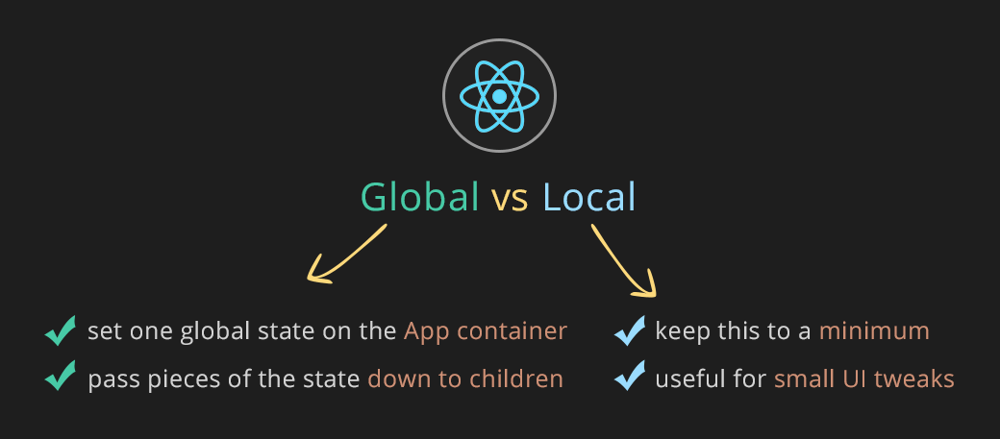

# React.js 的 state 碎碎念

 

**注**：头图来自于 [https://ihatetomatoes.net/react-state-management-tutorial-do-you-really-need-redux-or-mobx/](https://ihatetomatoes.net/react-state-management-tutorial-do-you-really-need-redux-or-mobx/)  

`React`里的组件，有从父级组件传下来的props，也可以有自己的状态state。在state改变时，会触发组件重新render。

但是在实际开发中，经常会在state上很纠结，比如下面这些问题：

* 哪些是state：组件上有很多状态，哪些状态是组件的state(哪些是从父级来的props)
* state放在哪儿：如果有全局的状态管理比如 `redux`，组件内部应该维持自己的state么，还是全部放到全局的store
* 怎么修改state

PS：每次有疑问的时候，我强烈建议先把官方的 [thinking in react](https://reactjs.org/docs/thinking-in-react.html) 翻出来研读下，很多东西官方其实也提到了。

## 哪些状态属于state？

一个组件通常有很多状态，首先我们要识别出哪些是state。官方文档里是这样说的：

> To build your app correctly, you first need to think of the minimal set of mutable state that your app needs. The key here is [DRY: *Don’t Repeat Yourself*](https://en.wikipedia.org/wiki/Don%27t_repeat_yourself). Figure out the absolute minimal representation of the state your application needs and compute everything else you need on-demand

里面有几个关键字：state是可变的，state是代表状态的最小集合。

如果一个状态不可变，那没必要放到state里，直接写死就OK了；组件的状态很多，很可能一些状态是相互关联的，比如根据 A + B 两个状态，可以计算出第三个状态C，那么 A 和 B 就是state，但是C不是。

通常来说，以下几种状态，都 **不能** 作为state：

* 如果一个状态，**不会** 在 `render`里用到，那它一般不是state。比如一个定时器timer，通常不是state，没必要保存到 `this.state.timer`上，建议作为类的**实例属性** 就行了，比如 `this._timer` 
* 如果一个状态在父级传下来的props里，那它通常不是state。但是，在有的情况下，可以把props里的某个状态，作为组件本身某个state的 **初始值** 
* 如果一个状态 **不会**改变，那通常它不是state
* 如果一个状态，能够从其他的props或者state计算出来，那它也不是state。参考 `Vue`里的 *计算属性*。

## state放在哪儿？

经过第一部分，我们基本上能够正确的筛选出组件的state了。这时候需要明确一点：react是自上而下的**单向**数据流。实际应用中，在很多时候，我们发现两个底层的组件，都依赖同一个状态，那这个状态应该放在哪儿呢？按照官方文档里的说法，要识别出哪个state交给具体的哪一个组件维护，是react开发者最有挑战的事。

同样，在 [thinking in react](https://reactjs.org/docs/thinking-in-react.html) 里，也有提到怎么判断state放在哪一层组件的问题。针对每一个state，我们都进行如下判断：

* 如果这个state只是某一个组件内部在使用，那可以把state放在该组件内部。比如tab下当前显示的序号
* 如果一个state被多个组件使用到，那找到所有用到这个state的组件的公共父组件，把state放在这个公共父组件上，也可以是这个公共父组件的更上层组件

在原生react开发中，通过这2个方法，基本能确定state应该放在哪一个组件的问题。但是在实际开发中，在很多情况下，我们会在最顶层的`<App />`组件里，请求一些数据，然后把这些数据保存在`<App />`的state上。在App下面，我们会包含很多的`容器组件(Container component)`，并且把state中的不同数据，作为props传给对应的容器组件。容器组件内部，可能会进一步包含更细粒度的容器组件，直到我们整个组件树的最底层，`展示型组件(dummy presentational component)`。如果层级不多，可能不会太混乱。但是组件层级一旦多起来，在这么多层级里透传props，也是相当麻烦。所以有了 `React Context` 和 全局状态管理`global state management`。

全局状态管理，`redux`广泛使用的，那么，哪些state应该放在组件里，哪些应该放在`redux`里呢？答案是 It depends。用那句话说就是，没有银弹。

你可以：1) 把所有state都放在`redux`里维护；2)也可以只把全局共享的数据，放在`redux`里，对于那些只属于某个子页面、子功能的state，还是可以放在state所属的`容器组件`里，甚至某个state只在某一个组件里用到，也可以只放在该组件里。

根据大佬们的说法，针对state的存放位置，大概可以有这么几个地方：

* 全局store：需要全局共享的状态，或者会有复杂变更的状态，放在 `redux` 里
* 区域container级别：在一些子功能、子模块的 `容器组件`里，维护只属于该容器以及该容器下共享的状态
* 某个组件内：可以认为也是区域 `容器组件`，只是这类组件粒度更小，内部可能会有一些自己内部的展示相关state，比如一个可折叠样式是展开还是收起

## 怎么修改state？

怎么修改state？这也算一个问题么？感觉有凑字数的嫌疑了……

其实这还是算一个问题的。那我们目前的页面来说，**没有**用到`redux`这样的全局状态管理，也没用上`React Context`来解决不断透传props的问题(惭愧啊😓)，通常我们页面是一个大的根组件，我们在根组件的 `componentDidMount`里会异步请求一些数据，拿到数据后，把后端返回的一大坨在根组件上调用 `this.setState`。所以我们这里单独谈谈 `setState`，先不谈 `redux` 这样的高级货了(毕竟也没怎么用过)。

首先，`setState`调用 **可能** 是异步的！！你在 `setState`之后立即读取 `this.state.xxx`，**有可能**读取到的还是修改之前的值！！

同时，`setState` 是把我们传入的变更值，和之前的state，做 **浅合并** ，如果我们的state是一个包含了嵌套的复杂结构，我们在修改state的时候必须要很小心。因为 `setState` 做 **浅合并** 的原因，在state包含复杂嵌套的时候，我们也很难在 `shouldComponentUpdate`里做优化，因为我们可能是改了state里很深的一个字段，但是外层的 **引用** 是没有变的。

怎么办？[Immutable.js](https://immutable-js.github.io/immutable-js/) 。具体怎么用，我们也不太清楚😓……等下文了😉

Again，没有银弹！如果我们页面的state结构很简单，没有复杂的嵌套，那就直接原生的JSON一把梭，没必要引入 immutable 了，高射炮打蚊子很浪费子弹的！

**最后，再次推荐没事多读读官方的 [thinking in react](https://reactjs.org/docs/thinking-in-react.html) ，没事多读读，神清气爽；有问题多读读，提神醒脑。** 

## 相关链接

* [thinking in react，没事多读读](https://reactjs.org/docs/thinking-in-react.html)
* [How to handle state in React. The missing FAQ](https://medium.com/react-ecosystem/how-to-handle-state-in-react-6f2d3cd73a0c)
* [Where to Hold React Component Data: state, store, static, and this](https://medium.freecodecamp.org/where-do-i-belong-a-guide-to-saving-react-component-data-in-state-store-static-and-this-c49b335e2a00) 
* [Question: How to choose between Redux's store and React's state?](https://github.com/reduxjs/redux/issues/1287) 
* [In depth: When and why are setState() calls batched?](https://stackoverflow.com/a/48610973/458193)
* [In depth: Why isn’t this.state updated immediately?](https://github.com/facebook/react/issues/11527#issuecomment-360199710)  

​                ———— 时2019年4月11日周四晚 20:33 竣工于帝都五道口清华科技园